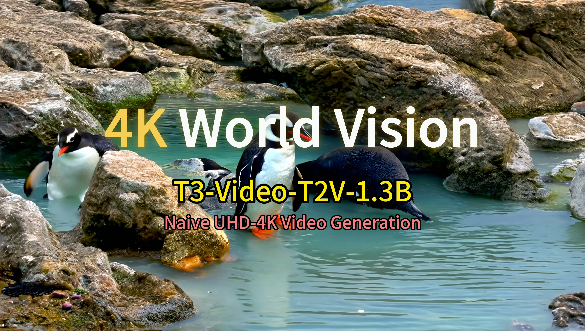

# T3-Video

-----

<p align="center">
    🤓 <a href="https://zhangzjn.github.io/projects/T3-Video">Project</a> &nbsp&nbsp | 📑 <a href="https://arxiv.org/abs/2512.13492">Paper</a> &nbsp&nbsp | 🤗 <a href="https://huggingface.co/APRIL-AIGC/T3-Video">Pretrained T3-Video Weights (4K)</a>&nbsp&nbsp
<br>

-----

[**Transform Trained Transformer: Accelerating Naive 4K Video Generation Over 10$\times$**](https://arxiv.org/abs/2512.13492)

🎋 **Click ↓ to watch `4K World Vision` demo by native 4K video generation model [T3-Video-Wan2.1-T2V-1.3B](https://huggingface.co/APRIL-AIGC/T3-Video)**
[](https://www.youtube.com/watch?v=mCTu6f2vAyU)

## TODO
- [x] Release T2V weights: `T3-Video-Wan2.1-T2V-1.3B` and `T3-Video-Wan2.2-T2V-5B`.
- [x] Release [4K-VBench](#4K-VBench)
- [x] Release [4K-World-Vision](#4K-World-Vision) for the presented demo.
- [x] Release inference code.
- [ ] Release training code.


## Quickstart
1. Refer to [DiffSynth-Studio/examples/wanvideo](https://github.com/modelscope/DiffSynth-Studio/tree/main/examples/wanvideo) for environment preparation.
2. Download [Wan2.1-T2V-1.3B](https://huggingface.co/Wan-AI/Wan2.1-T2V-1.3B) model using huggingface-cli:
``` sh
pip install "huggingface_hub[cli]"
huggingface-cli download --repo-type model Wan-AI/Wan2.1-T2V-1.3B --local-dir weights/Wan2.1-T2V-1.3B --resume-download
huggingface-cli download --repo-type model Wan-AI/Wan2.2-TI2V-5B --local-dir weights/Wan2.2-TI2V-5B --resume-download
```
3. Download [T3-Video](https://huggingface.co/APRIL-AIGC/T3-Video) models using huggingface-cli:
``` sh
huggingface-cli download --repo-type model APRIL-AIGC/T3-Video --local-dir weights/T3-Video --resume-download
```
4. Infer native 4K videos with `T3-Video-Wan2.1-T2V-1.3`.
``` sh
python infer_multi_gpu.py --model_id Wan-AI/Wan2.1-T2V-1.3B --text_path models/Wan2.1-T2V-1.3B/models_t5_umt5-xxl-enc-bf16.pth --dit_path "models/Wan2.1-T2V-1.3B/diffusion_pytorch_model*.safetensors" --vae_path models/Wan2.1-T2V-1.3B/Wan2.1_VAE.pth --dit_path_full_pretrained models/T3-Video/T3-Video-Wan2.1-T2V-1.3B.safetensors --height 2176 --width 3840 --num_frames 81 --out_dir output/T3-Video-Wan2.1-T2V-1.3B-4K-World-Vision-seed0-step50 --json_file 4K-World-Vision/4K-World-Vision.json --data_root 4K-World-Vision --start_id=0 --end_id=-1 --tiled true --seed 0 --num_groups 8 --num_inference_steps 50
```
5.Infer native 4K videos with `T3-Video-Wan2.2-T2V-5B`.

Change the mode to `wan2.2_2176_3840` in `Line-180` of the file `diffsynth/models/wan_video_dit.py`.

``` sh
python infer_multi_gpu.py --model_id Wan-AI/Wan2.2-TI2V-5B --text_path models/Wan2.2-TI2V-5B/models_t5_umt5-xxl-enc-bf16.pth --dit_path "models/Wan2.2-TI2V-5B/diffusion_pytorch_model*.safetensors" --vae_path models/Wan2.2-TI2V-5B/Wan2.2_VAE.pth --dit_path_full_pretrained models/T3-Video/T3-Video-Wan2.2-T2V-5B.safetensors --height 2176 --width 3840 --num_frames 81 --out_dir output/T3-Video-Wan2.2-T2V-5B-4K-World-Vision-seed0-step50 --json_file 4K-World-Vision/4K-World-Vision.json --data_root 4K-World-Vision --start_id=0 --end_id=-1 --tiled true --seed 0 --num_groups 8 --num_inference_steps 50
```

## License Agreement
Copyright (c) 2025 T3-Video

Licensed under the Apache License, Version 2.0 (the "License");
you may not use this file except in compliance with the License.
You may obtain a copy of the License at

    http://www.apache.org/licenses/LICENSE-2.0

Unless required by applicable law or agreed to in writing, software
distributed under the License is distributed on an "AS IS" BASIS,
WITHOUT WARRANTIES OR CONDITIONS OF ANY KIND, either express or implied.
See the License for the specific language governing permissions and
limitations under the License.

Also, users must follow [Wan-Video/Wan2.1/LICENSE.txt](https://github.com/Wan-Video/Wan2.1/blob/main/LICENSE.txt) to use Wan-related models. 


## Acknowledgements
We would like to thank the contributors to the [Wan2.1](https://github.com/Wan-Video/Wan2.1), [Wan2.2](https://github.com/Wan-Video/Wan2.2), [Qwen](https://huggingface.co/Qwen), [umt5-xxl](https://huggingface.co/google/umt5-xxl), [diffusers](https://github.com/huggingface/diffusers) and [HuggingFace](https://huggingface.co) repositories, for their open researches.

## Citation

If you find our work helpful, please cite us.

```
@misc{t3video,
    title={Transform Trained Transformer: Accelerating Naive 4K Video Generation Over 10$\times$}, 
    author={Jiangning Zhang and Junwei Zhu and Teng Hu and Yabiao Wang and Donghao Luo and Weijian Cao and Zhenye Gan and Xiaobin Hu and Zhucun Xue and Chengjie Wang},
    year={2025},
    eprint={2512.13492},
    archivePrefix={arXiv},
    primaryClass={cs.CV},
    url={https://arxiv.org/abs/2512.13492}, 
}
```


